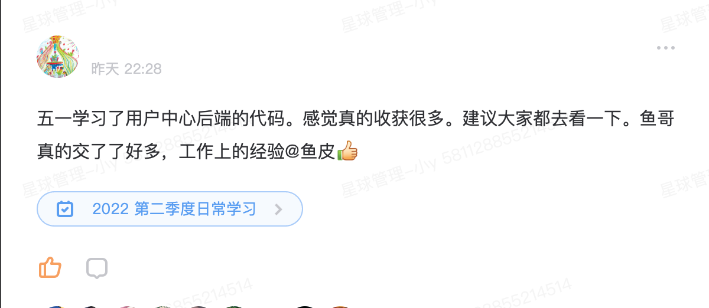
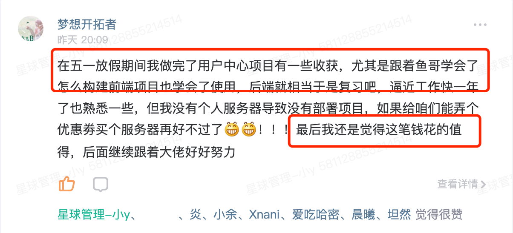
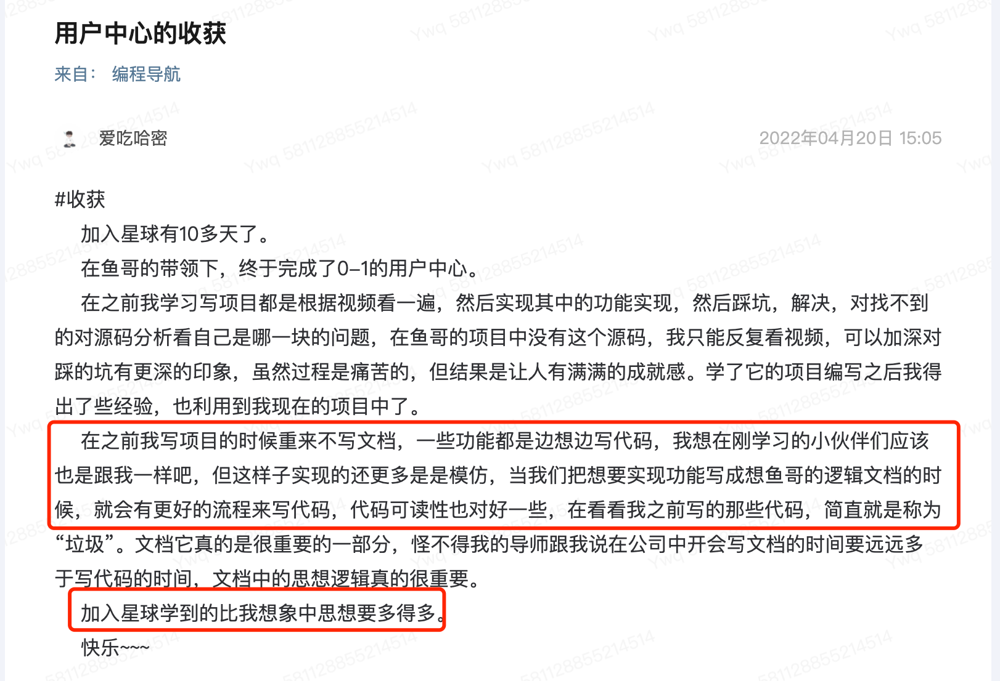

# 鱼皮 - 用户中心项目

> 作者：[程序员鱼皮](https://github.com/liyupi)

本项目为 [编程导航知识星球](https://yupi.icu) 的原创全栈项目，后端代码开源。

[加入星球](https://yupi.icu) 可获得该项目从 0 到 1 的完整视频教程 + 源码 + 笔记 + 答疑 + 简历写法。

## 项目简介

一个企业中最最最常用的系统 —— `用户中心` ，说白了，就是一个简单的 “用户管理系统” ，实现了用户注册、登录、查询等基础功能。如图：

虽然系统逻辑和功能并不复杂，代码量也不多，但是正因如此，大家才不需要关注特定的、复杂的业务流程，可以更轻松地学习到 **通用的技术和做项目的经验** 。

麻雀虽小五脏俱全，鱼皮真真正正地 **从 0 到 1 全程直播** 带大家完成了这个项目的完整前端和后端！从产生想法、到需求分析、到技术选型、系统设计、项目初始化、编码实现、测试、再到最后的部署上线，每一个环节我都从理论到实践给大家讲的明明白白、每一个细节都不放过！再加上直播过程中踩的种种坑点以及问题的解决，相信一定可以帮助大家走出书本、走出校园、走出死板 / 单纯讲知识点的网课和教程，学到企业 真正需要的开发技能和经验。

鱼皮可以很负责任地说，如果你已经有过一些前端或后端开发的基础知识，完完整整地看完这个项目并跟着实践后，你绝对可以 **独立、一条龙开发和上线** 绝大多数常见的系统了！

## 本项目适合的同学

1. 学过基本的前端（HTML + CSS + JS 三件套）或后端开发技术（Java Web）
2. 还不知道怎么独立做出完整的项目，想了解规范的开发流程
3. 想快速学习自己不熟悉的技术并且了解其应用（比如你只会前端，想了解后端）
4. 想全方位提高自己的编程能力
5. 想提升做项目的经验和系统设计能力
6. 想学习更多企业主流开发技术
7. 想给简历增加项目经验
8. 想开发和上线自己的网站

## 技术选型

### 前端

主要运用阿里 Ant Design 生态：

- HTML + CSS + JavaScript 三件套
- React 开发框架
- Ant Design Pro 项目模板
- Ant Design 端组件库
- Umi 开发框架
- Umi Request 请求库

### 后端

- Java 编程语言
- Spring + SpringMVC + SpringBoot 框架
- MyBatis + MyBatis Plus 数据访问框架
- MySQL 数据库
- jUnit 单元测试库

### 部署

- 单机部署
- Nginx
- 容器

## 项目收获

1. 学会前后端企业主流开发技术的应用
2. 了解做项目的完整流程，能够独立开发及上线项目
3. 学到系统设计的方法和经验
4. 学到一些实际的编码技巧，比如开发工具、快捷键、插件的使用
5. 学到代码的优化技巧，比如抽象、封装、提高系统性能、节约资源的方法
6. 学习登录态、代理、多环境、容器、跨域等重要的开发知识
7. 学到一些源码阅读的技巧
8. 提升自主解决问题的能力

## 学习者的反馈

## 项目大纲

1. 项目简介和计划
2. 企业做项目完整流程介绍
3. 需求分析
4. 技术选型（各技术作用讲解）
5. 前端项目初始化
    1. 框架及项目目录介绍
    2. 组件引入
    3. 框架瘦身
6. 后端项目初始化
    1. 3 种初始化 Java 项目的方式
    2. 环境搭建（比如 MySQL 安装）
    3. SpringBoot 整合 SSM、MyBatis 框架
    4. 项目分层介绍
7. 数据库表设计
8. 注册功能
    1. 详细设计
    2. 前端开发
        1. 快速页面开发
        2. 表单组件使用
    3. 后端开发
        1. 代码生成器的使用
        2. 接口、业务逻辑开发
        3. 单元测试
        4. API 接口测试
9. 登录功能
    1. 详细设计
    2. 前端开发
        1. 登录态管理
        2. 请求库的使用
        3. 页面开发及验证
    3. 后端开发
        1. 登录态管理（Cookie 和 Session）
        2. 接口开发及测试
    4. 前后端交互
    5. 代理知识讲解
        1. 正向代理
        2. 反向代理
        3. 如何开启本地代理
10. 用户管理
    1. 前端开发
    2. 后端开发
11. 用户注销功能
    1. 前端开发
    2. 后端开发
12. 前端代码优化
    1. 全局请求响应拦截器的封装
    2. 友好提示
13. 后端代码优化
    1. 通用返回对象
    2. 自定义异常及错误码
    3. 全局异常处理器
    4. 补充用户校验
14. 项目部署
    1. 多环境理论及实战
    2. 四种部署方式实战
        1. 原始前端 Nginx / 后端 SpringBoot 部署
        2. 宝塔 Linux
        3. Docker 容器（常用命令全部演示）
        4. 容器平台
15. 项目上线
    1. 域名解析
    2. 跨域问题解决（3 种思路）
16. 用户中心项目扩展思路和优化点

## 项目资料

[加入星球](https://yupi.icu) 可获得：

1. 完整视频教程
2. 视频教程大纲
3. 完整项目源码
4. 项目学习笔记
5. 本项目交流答疑
6. 本项目简历写法
7. 更多原创项目教程和学习专栏

## 版权声明

请尊重原创！与其泄露资料、二次售卖，不如邀请他人加入星球得大额赏金：https://t.zsxq.com/0eP82UuaG
